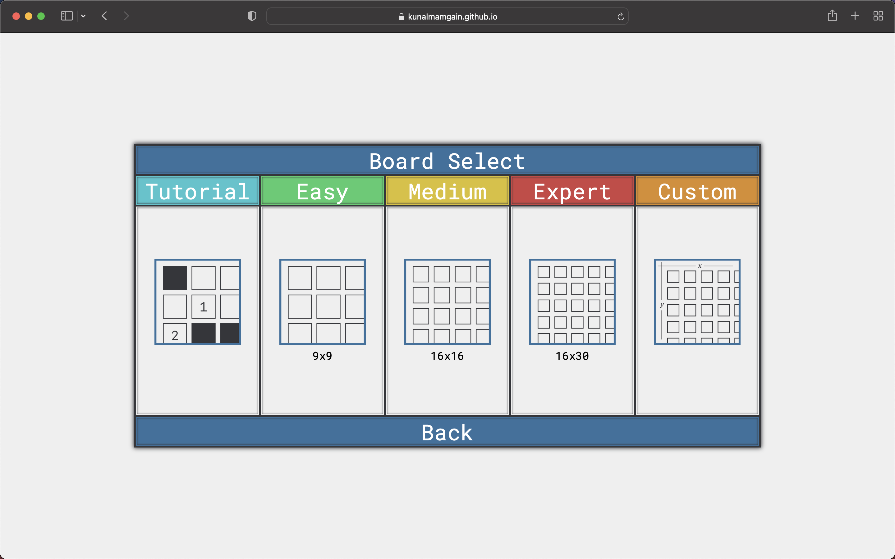
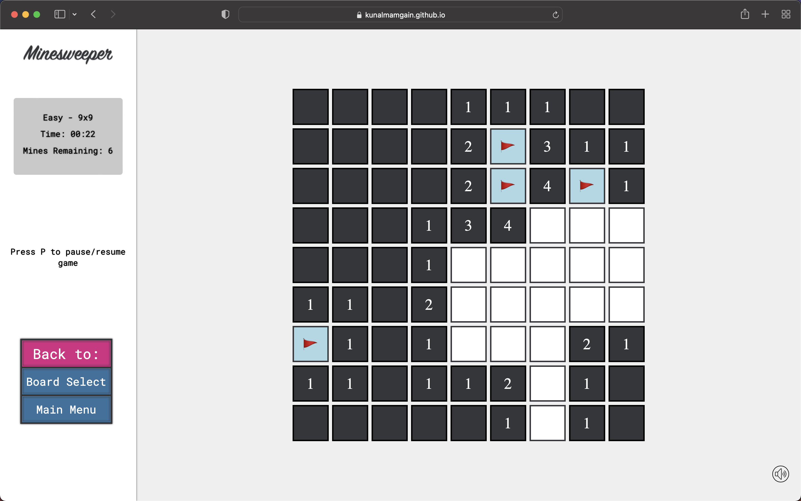
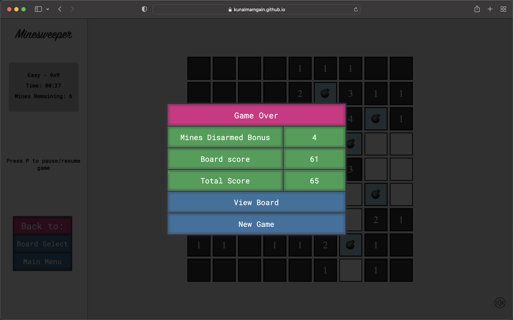

<h1 align="center">
Minesweeper :joystick: 
</h1>

Play Minesweeper on different difficulty levels or play the tutorial to know the rules.
 
Works right in your <b>Browser</b> 
 

### Live demo
 Check it out at [website](https://kunalmamgain.github.io/Minesweeper/)
### Screenshots

* Choose from various levels or create your own custom level.
 

* Left click for opening the block and right click for marking it.

* Final scores displayed on completion or fault.

